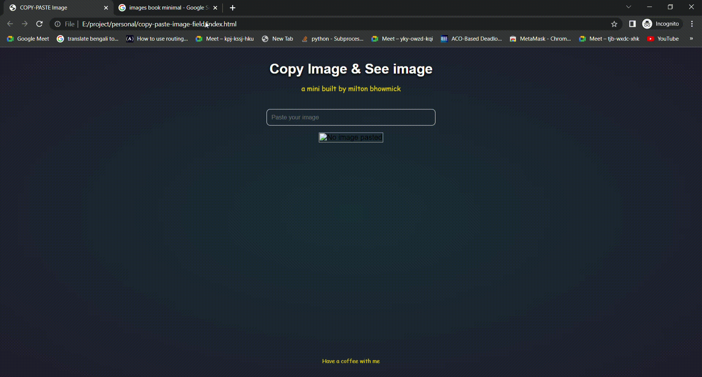

<h1 align="center">COPY IMAGE - PASTE IMAGE </h1>

A mini tricks between <b>input field</b> and <b>img tag</b> in html to show an image.

	 

### Play it by yourself
<a href="https://miltonbhowmick.github.io/copy-paste-image-field/">Demo</a>

### How it works

### Which logic helps
- Use `event.clipboardData` or `event.originalEvent.clipboardData`.
- `event.clipboardData` or `event.originalEvent.clipboardData` contains items if they have. If they contain, write `var items = (event.clipboardData || event.originalEvent.clipboardData).items;`.
- Now, you have `items`. Its `items`, you can do a loop 💁‍♂️. You can see each element by index of that loop `items[index]`.
- We need only file item from `items[index]`. So, you may do a check like this `if (item.kind === 'file')`.
- Get the blob data of this file item by writing `var blob = item.getAsFile();`.
- As it is a file, you have to read the file item. To read a file item, Javascript has a class `FileReader()`. Write `var reader = new FileReader();`.
- How can you see If a file is not loaded 🤫?. Write `reader.onload = function (event) {};`.
- Inside the above `onload` function, you can write `document.getElementById("pastedImage").src = event.target.result;` of your image html tag ``.
- Then copy image and paste image and BOOM!!!. 

